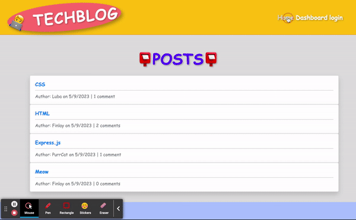

# CMS style Tech Blog

12th Assignment of UCB Extension Web Development Bootcamp

Please visit the [Heroku website](https://cmslubatechblog.herokuapp.com/)

## Desciption

a CMS-style blog site that allows users to create accounts, log in, create blog posts, read existing blog posts, leave comments, and manage their posts.

When a user visits the site for the first time, they are presented with the homepage, which includes existing blog posts (if any), navigation links for the homepage and the dashboard, and the option to log in. Clicking on the homepage link takes the user back to the homepage, while clicking on any other links in the navigation prompts the user to either sign up or sign in.

If the user chooses to sign up, they are prompted to create a username and password, and once they click on the sign-up button, their credentials are saved, and they are logged into the site. On subsequent visits, when the user chooses to sign in, they are prompted to enter their username and password.

Once a user is signed in, they see navigation links for the homepage, the dashboard, and the option to log out. Clicking on the homepage link takes the user to the homepage, where they can see existing blog posts that include the post title and the date created. Clicking on an existing blog post takes the user to a page displaying the post title, contents, post creator's username, and date created, and allows them to leave a comment. If the user enters a comment and clicks on the submit button while signed in, the comment is saved, and the post is updated to display the comment, the comment creator's username, and the date created.

Clicking on the dashboard link takes the user to the dashboard, where they can see any blog posts they have already created, and the option to add a new blog post. Clicking on the button to add a new blog post prompts the user to enter both a title and contents for their blog post. Clicking on the button to create a new blog post saves the title and contents of the post and takes the user back to an updated dashboard with their new blog post. Clicking on one of the user's existing posts in the dashboard allows them to delete or update their post and returns them to an updated dashboard.

Finally, clicking on the logout option in the navigation signs the user out of the site. If the user is idle on the page for more than a set time, they are automatically signed out of the site to ensure security.

---

## Appearance



## Technology Used

- [Git](https://git-scm.com/)
- [JavaScript](https://www.javascript.com/)
- [Node.js](https://nodejs.dev/)
- [MySQL](https://www.mysql.com/)
- [MVC](https://developer.mozilla.org/en-US/docs/Glossary/MVC)
- [Express.js](https://expressjs.com/)
- [Heroku](https://heroku.com)
- [Handlebars.js](https://handlebarsjs.com/)

## Requirements

Create .env file and add:

```
DB_NAME='ecommerce_db'
DB_USER=<ADD USER HERE>
DB_PASSWORD=<ADD YOUR PASSWORD HERE>
```

and create a database on your machine.

or

```
JAWSDB_URL = <YOUR LINK>
```

```
npm install
```

## Author Info

### Liubov Sobolevskaya

- [LinkedIn](https://www.linkedin.com/in/liubov-sobolevskaya/)
- [Github](https://github.com/LiubovSobolevskaya)
- [Kaggle](https://www.kaggle.com/lyubovsobolevskaya)
